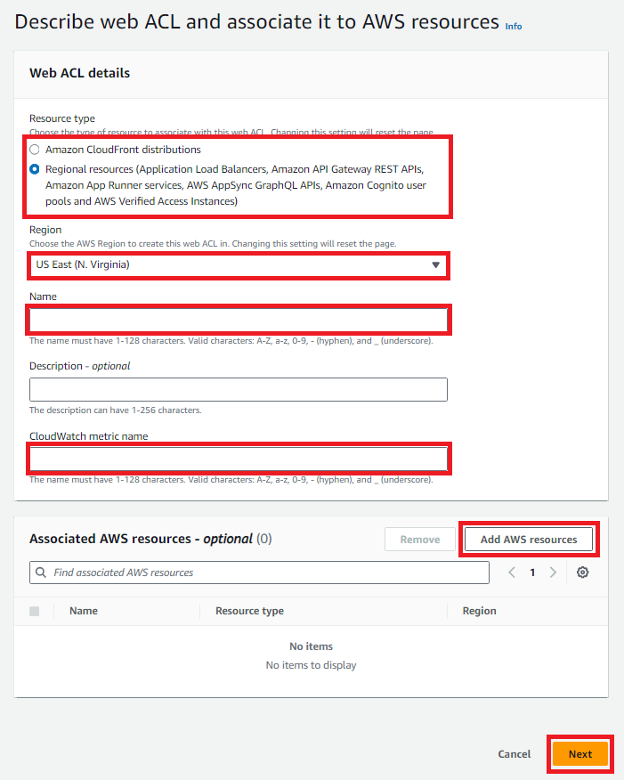
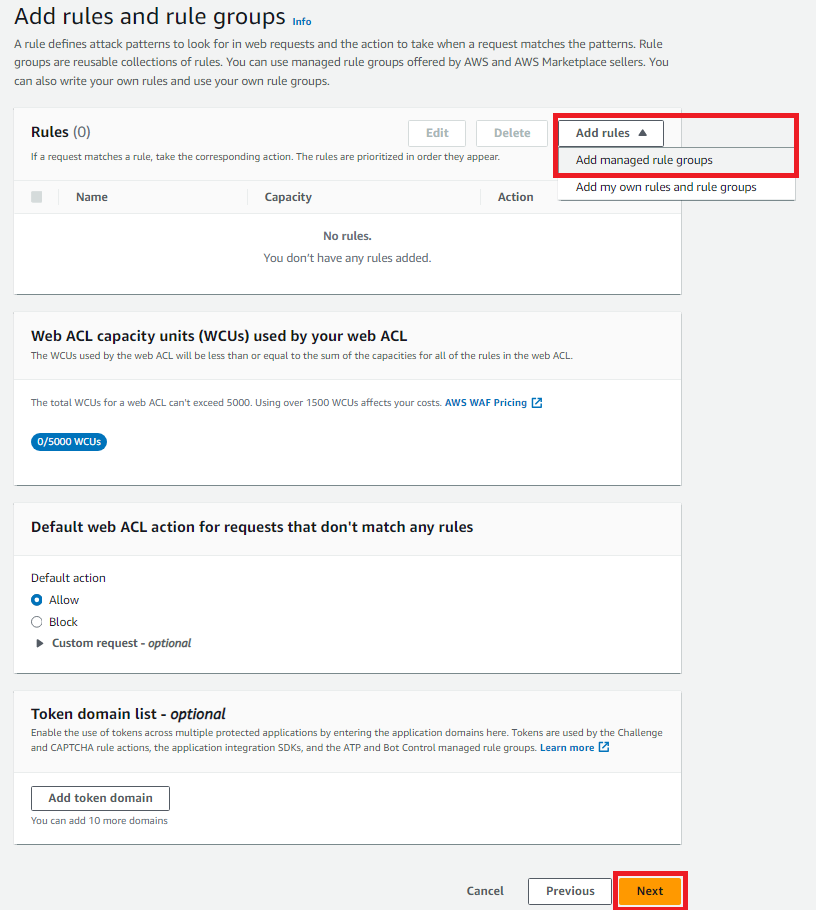
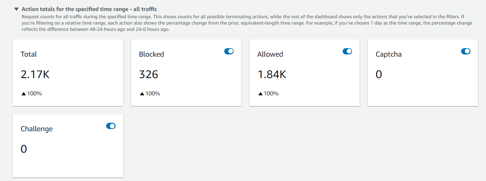
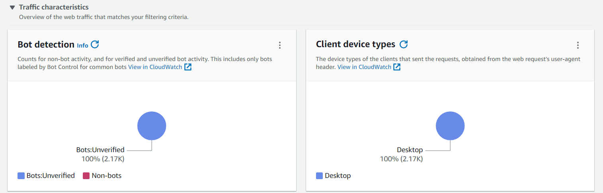
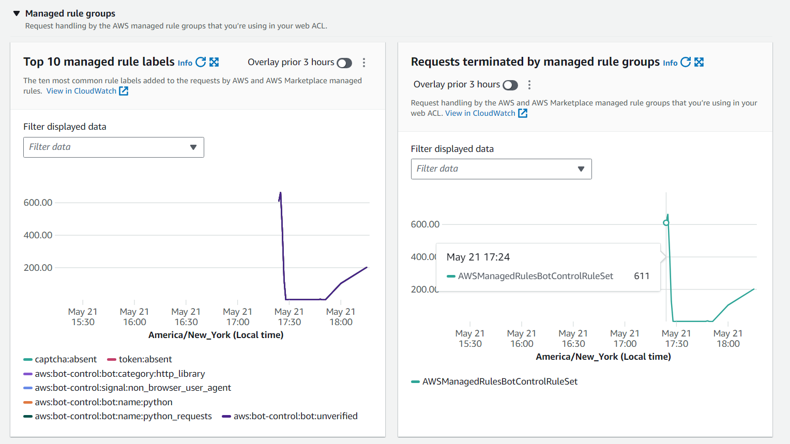

# Deplyoing and Securing a Machine Learning Model with AWS

## Introduction
My senior design project goal was to deploy a machine learning model and ensure its security
against potential attack vectors. With the increasing adoption of machine learning, it is
crucial to be able to understand how to secure ML models.
This documentation provides a solution with all the steps to securing the endpoint of my deployed model.

## Goal
- Deploy a machine learning model on a cloud platform.
- Implement robust security measures to protect the model's endpoint.

## Background

### ML Model
I decided to choose the
[Credit Card Transactions Fraud Detection Dataset](https://www.kaggle.com/datasets/kartik2112/fraud-detection)
from Kaggle in order to train my model. The relevant columns for my
model are
- `'cc_num'`: Credit card number used for the transaction.
- `'amt'`: Amount of the transaction.
- `'lat'`: Latitude of the transaction location.
- `'long'`: Longitude of the transaction location.
- `'merch_lat'`: Latitude of the merchant location.
- `'merch_long'`: Longitude of the merchant location.
- `'is_fraud'`: Binary indicator (0 or 1) representing whether the transaction is fraudulent (0 is not fraud, 1 is fraud).

I decided to use a Random Forrest Classifier for my ML model
since it is the most appropriate for this scenario. Each decision tree
of the random forest is trained on some randomly selected sample. Once
all the trees are created, the model predicts the class label of
the input features by majority voting of all the decision trees.
I varied the values of some parameters of the `sklearn.RandomForestClassifier`and found that to get the best model for my
dataset I needed to increase the number of decision trees, introduce
randomness when sampling from the dataset, and have the weights of both
classes (0 and 1) to be balanced. I then varied the number of data
the model trained on to get the most optimal model. In Figure 1 I can
see the heat maps of the normalized confusion matrix and accuracy
of each model when trained on different sizes of data. From here
I can see that the most optimal model is when I train
on 100000 rows.


*Figure 1: Heat map of normalized confusion matrices.*

### Deployment
I decided to utilize AWS services since I collaborated with
Capital One, and
they mostly use AWS for their applications.
I chose Amazon SageMaker for a few reasons such as
- It is fully managed meaning the
user doesn't have to worry about the operational aspects of
running a machine learning platform.
- It can be easily
integrated with other AWS services.
- It is highly scalable.

To find the training script and deployment notebook of the model
refer [train.py](train.py) and [model-deploy.ipynb](model-deploy.ipynb). The following contains the details about the deployed model
```
---- METRICS RESULTS FOR TESTING DATA ----
Total Rows are: 555719
[TESTING] Model Accuracy is: 0.9897520149571996
[TESTING] Confusion Matrix:
[[548852   4722]
 [   973   1172]]
[TESTING] Normalized Confusion Matrix:
[[0.99146998 0.00853002]
 [0.45361305 0.54638695]]
[TESTING] Testing Report:
              precision    recall  f1-score   support

           0       1.00      0.99      0.99    553574
           1       0.20      0.55      0.29      2145

    accuracy                           0.99    555719
   macro avg       0.60      0.77      0.64    555719
weighted avg       1.00      0.99      0.99    555719
```
Once I deploy my model, then on the **Amazon SageMaker**→**Training**→**Training jobs** dashboard
I can see my completed training job as in Figure 2.


*Figure 2: Amazon SageMaker Training jobs dashboard.*

I can also see my deployed model on the **Amazon SageMaker**→**Inference**→**Endpoints** dashboard as in Figure 3.


*Figure 3: Amazon SageMaker Endpoint dashboard.*

## Securing the Endpoint Architecture
To secure my ML endpoint I decided to follow the best practices
mentioned in the
[Security in Amazon API Gateway](https://docs.aws.amazon.com/apigateway/latest/developerguide/security.html)
developer guide. I built the architecture shown
in Figure 4. The reasons of having this type of architecture
is that the endpoint of the ML model can only be accessed
by an AWS account that has appropriate permissions and by the
Lambda Function. To allow other users to infer the model
I add an API Gateway that triggers the API. As a first
security measure I require the API to have a key. Therefore,
only users with both the link and the key are allowed to
infer the model. Having only an API key doesn't prevent
from DDoS attacks or other kinds of malicious attacks.
This is why I use AWS Shield to protect my API from some of
the most common attacks. Features that AWS Shield offer are:

- **Agile protection against web attacks:** AWS WAF rule propagation and updates take just under a minute, enabling for fast reaction when under an attack or when security issues arise. WAF supports hundreds of rules that can inspect any part of the web request with minimal latency impact to incoming traffic.
- **Improved web traffic visibility:** AWS WAF gives near real-time visibility into my web traffic, which I can use to create new rules or alerts in Amazon CloudWatch. In addition, AWS WAF offers comprehensive logging, allowing us to capture each inspected web request’s full header data for use in security automation, analytics, or auditing.
- **Save time with managed rules:** With managed Rules for AWS WAF, I can quickly get started and protect my API against common threats. Managed Rules are updated automatically and are available from AWS or AWS Marketplace sellers.
- **Ease of deployment and maintenance:** AWS WAF is easy to deploy and protects application(s) deployed on either Amazon CloudFront, the Application Load Balancer, or Amazon API Gateway. There is no additional software to deploy, DNS configuration, or SSL/TLS certificate to manage.

In [Testing the AWS Shield](#testing-the-aws-shield) section
I show examples of these features tested later in this document.


*Figure 4: Endpoint Architecture.*

### Creating a Lambda Function
Navigate to the AWS Lambda Function dashboard and press **Create function**. To set up the function refer to Figure 5. Choose *Python 3.12* under the **Runtime** option.


*Figure 5: Lambda set up.*

Once I create my function I use the following code that infers
the model:
```python
import os
import io
import boto3
import json
import csv

# grab environment variables
ENDPOINT_NAME = os.environ['ENDPOINT_NAME']
runtime= boto3.client('runtime.sagemaker')

def lambda_handler(event, context):
    print("Received event: " + json.dumps(event, indent=2))
    
    data = json.loads(json.dumps(event))
    payload = data['data']
    print(payload)
    input_data = [[x for x in payload]]
    payload_input = json.dumps(input_data)
    
    response = runtime.invoke_endpoint(EndpointName=ENDPOINT_NAME,
                                       ContentType='application/json',
                                       Body=payload_input)
    print(response)
    result = json.loads(response['Body'].read().decode())
    print(result)
    
    return {
        'statusCode': 200,
        'body': result
    }
```
Before deploying, set up the environment variable found under the
**Configuration** tab. I set the value of `ENDPOINT_NAME` to the name
of my endpoint found on Amazon SageMaker Endpoint dashboard
(Figure 3). My Lambda Function dashboard should look something like
Figure 6.


*Figure 6: Lambda Function dashboard.*

### Creating an Amazon API Gateway
To set up the API Gateway navigate to the **Amazon API Gateway**
dashboard and press **Create API**. Press **Build** for
the **REST API** and then fill out the required boxes (Figure 7).


*Figure 7: API Gateway set up.*

Once I create my API, I create a **POST** method to the appropriate
Lambda function with a **required key**(Figure 8).


*Figure 8: POST method set up.*

Once I are done with this setup my dashboard should look
something like Figure 9.


*Figure 9: API dashboard.*

To create an API key navigate to the API keys tab and press **Create API key**
(Figure 10).


*Figure 10: API key set up.*

To associate the API key with the API I must create an API Usage
plan. I do that by pressing **Create usage plan** under the
**Usage plan** tab, then fill out the following boxes as in Figure 11.


*Figure 11: Usage plan set up.*

Once setting up the usage plan, on the **Usage plans** dashboard
I must associate the API stage with the API key as in Figure 12.


*Figure 12: Associating API stage with API key.*

### Creating an AWS Shield
To create an AWS Shield navigate to the **AWS WAF & Shield** dashboard and under **Web ACLs** press **Create web ACL**. You will have to fill in the
name and add the resource you want to secure (Figure 13).


*Figure 13: ACL set up.*

There are a variety of rules that one can choose from some examples include
- **Account creation fraud prevention:** Provides protection against the creation of fraudulent accounts on your site.
- **Account takeover prevention:** Provides protection for your login page against stolen credentials, credential stuffing attacks, brute force login attempts, and other anomalous login activities.
- **Bot Control:** Provides protection against automated bots that can consume excess resources, skew business metrics, cause downtime, or perform malicious activities.
- **Admin protection:** Contains rules that allow you to block external access to exposed admin pages.
- **Amazon IP reputation list:** This group contains rules that are based on Amazon threat intelligence. This is useful if you would like to block sources associated with bots or other threats.
- **Anonymous IP list:** This group contains rules that allow you to block requests from services that allow obfuscation of viewer identity.
- **Linux operating system:** Contains rules that block request patterns associated with exploitation of vulnerabilities specific to Linux, including LFI attacks.

There are many more rules, but I just list few ones that 
are the most appropriate in this case.
I decided I would test out the Bot Control rule. To add you rules follow
the steps in Figure 14.


*Figure 14: ACL set up.*

## Testing the AWS Shield
Say that I was a bad actor, and I was trying to infer the model using
the API and I only know the API but not the API key. One way
of trying to figure out the API key is to just generate some
random strings and keep calling the API with the randomly generated
key. Of course in practice this would be hard to search for
since the search space of keys is very large. But say the
bad actor has only part of the key then this simulation
would still be a good way of testing this attack. The following
python script simulates the described attack.
```python
for i in range(100):
    headers = {
        "x-api-key": generate_random_string(40)
    }
    print(headers)
    response = requests.post(url, json=payload, headers=headers)
    if response.status_code == 200:
        result = response.json()
        print("API Response:", result)
    else:
        print("Request failed with status code:", response.status_code)
    
    print(i)

headers = {
    "x-api-key": api_key
}
print("Using correct API key")
response = requests.post(url, json=payload, headers=headers)
if response.status_code == 200:
    result = response.json()
    print("API Response:", result)
else:
    print("Request failed with status code:", response.status_code)
```

When the shield is not configured or when we allow traffic for the
`CategoryHttpLibrary` then our bad actor will be able to infer on
the model once the person gets the correct API key. As seen
in the output bellow the last line shows that the bad actor
can infer the model once he finds the correct API key.
```
.
.
.
95
{'x-api-key': 'V4NwtjdNxOhN5FhMN2HpMedBkV2Ro67qe4lDn3m7'}
Request failed with status code: 403
96
{'x-api-key': 'ifSxI5g658IHkbIQfTVgDUiot0Z4aEDixqefQw5z'}
Request failed with status code: 403
97
{'x-api-key': 'GpAbh6vVE96CIGLolvHzrmsg7jYp2yfZDrtSbuM2'}
Request failed with status code: 403
98
{'x-api-key': 'JKo8k89EQY4eg1Qm0IXuSihZPhKg4s774m5g5xkl'}
Request failed with status code: 403
99
Using correct API key
API Response: {'statusCode': 200, 'body': [0]}
```

When using the shield with the **Bot Control** rule and
blocking `CategoryHttpLibrary` traffic within the rule,
the shield will detect that it is a bot using the API
and will block the access. Therefore, even if the bad
actor finds the correct API key they wouldn't be able
to infer the model. This can be seen in the following
output. The last line is when the bad actor
does in fact use the correct API key but is still
not able to infer the model.
```
.
.
.
95
{'x-api-key': 'HDXHkDt5wG6bV2nDEvXZ6Bk2eLUQdk3C9oRq3San'}
Request failed with status code: 403
96
{'x-api-key': 'd2lV2izSZPWQJzaa7SCEXlLLzDtznjvBk1wjAPsE'}
Request failed with status code: 403
97
{'x-api-key': 'pKPgJbmA3hBmMF0qRShN0AE03ImwFj7I6ztaLcR7'}
Request failed with status code: 403
98
{'x-api-key': 'wKvM6bWbwwKIDtt8wLJoecw8Y0POQZD9XmHR8jkQ'}
Request failed with status code: 403
99
Using correct API key
Request failed with status code: 403
```

Another benefit of having AWS Shield is that we can 
view the incomming traffic and potentially monitor
threats. See Figures 15 to 18 to see the dashboard of AWS Shield
with all the monitored metrics.  

*Figure 15: AWS Shield dashboard.*

*Figure 16: AWS Shield dashboard.*

*Figure 17: AWS Shield dashboard.*

*Figure 18: AWS Shield dashboard.*


## Conclusions
From this project I learned how to train and deploy a Random Forest
Classifier in AWS. I learned about how to design an architecture
to best secure the endpoint. I learned all the different
services used in this project namely, AWS Sagemaker, Amazon Lambda,
Amazon API Gateway and AWS Shield. I learned about all the different rules
AWS Shield has to offer. In the future I would focus on testing
and modifying different rules to allow for a better security.
Some rules that I can potentially look into include the ones
listed above in section [Creating an AWS Shield](#creating-an-aws-shield).
I would also like to potentially test out all the categories under
the Bot Control rule.
